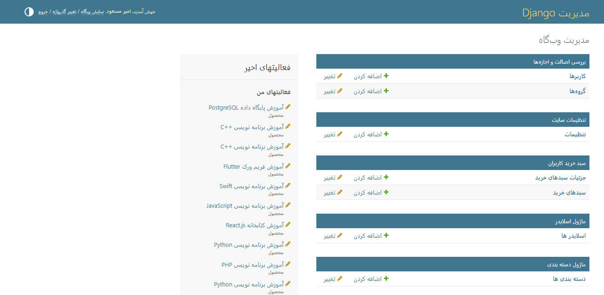
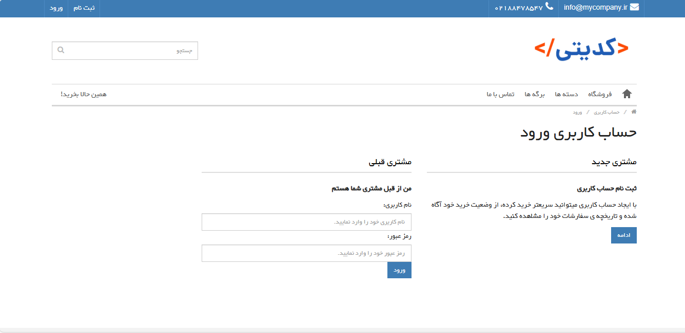
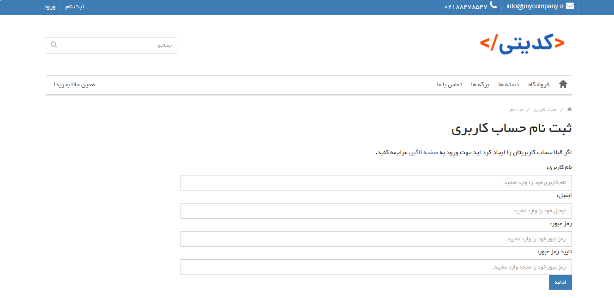
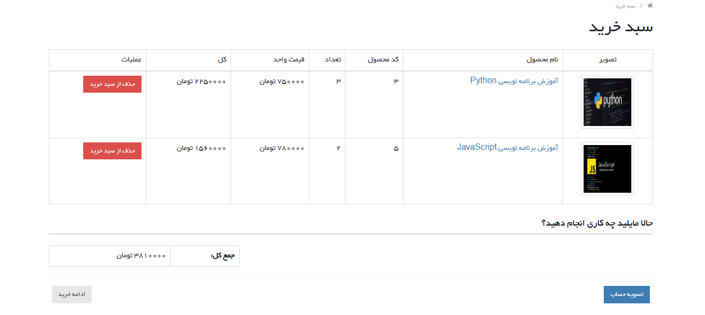
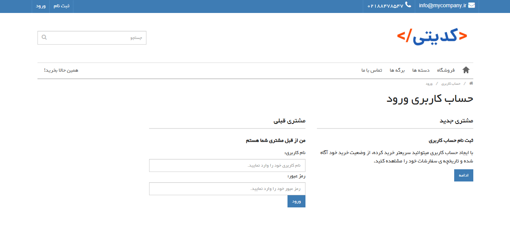
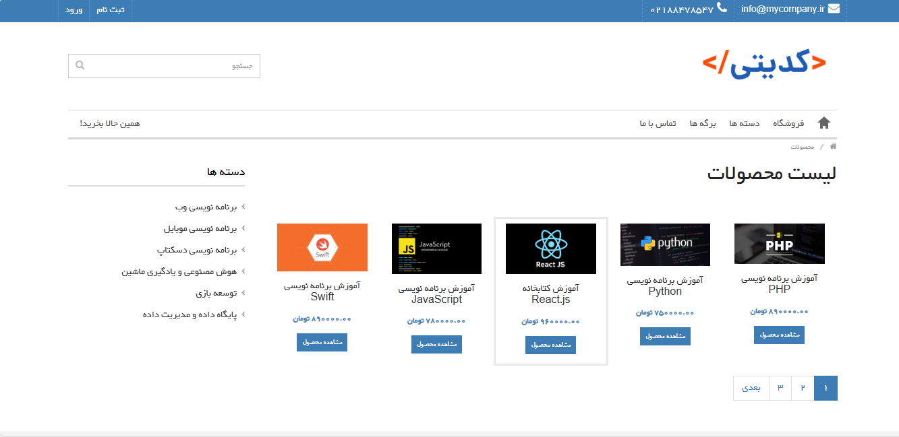

# 🖥️ Programming Courses Selling Website

Hello 

This is a simple **programming courses selling website** built with **Django** and **HTML**.  
It was created for my learning and practice in web development.

## 📈 Project Status

🔹 **Current Features:** 

- Display list of courses 📃
- Show course details 🔍
- Admin panel to manage courses ⚙️  
- Home page 🏠  
- User registration form 📝  
- User login form 🔐  
- Shopping cart form 🛒  
- Contact Us form (user to admin) ✉️

## 🔧 Technologies Used

- Python 🐍
- Django 💻
- HTML 🌐

## 📸 Preview

#### ⚙️ Admin Panel

#### 🔐 Login Page

#### 📝 Registration Page

#### 🛒 Shopping Cart Page

#### ✉️ Contact Us Page

#### 📦 Products / Courses Page

---

👨‍💻 **Developer:** 

- 
&nbsp;
<a href="https://github.com/masoud-zoghian" style="text-decoration:none; color:black;">
masoud-zoghian</a>

- 
&nbsp;
<a href="https://www.linkedin.com/in/masoud-zoghian" style="text-decoration:none; color:black; vertical-align: middle;">
masoud-zoghian</a>